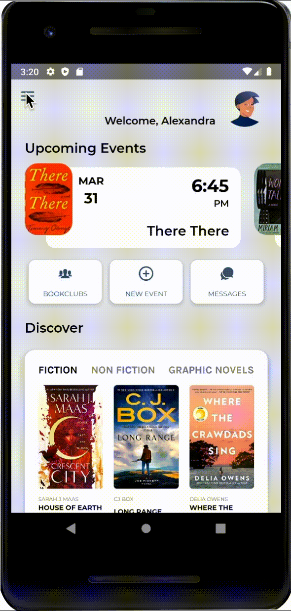

# README

BookClub is built with React Native. Created to help solve the problem of finding the perfect book and organzing a bookclub event by keeping it all in one place. Backend utilizes Google Firebase Authentication, Firebase Cloud Database and Firebase Storage, API calls from GoogleReads.com, Google Books and NYTimes. 
This was a study for full stack mobile design to combine high-end UX/UI design with scalable backend logic to create a real world working app that is ready to launch. 

 
 
 
 
 

# Getting Started

1. Install React Native as described at https://facebook.github.io/react-native/docs/getting-started.html#content

2. Clone this repository

3. Run ```npm install```, all required components will be installed automatically

* ## IOS
  * Run ```cd ios pod install```

* ## Android
  * No Steps required

# To Run on Simulation
  * ```react-native run-ios``` or ```react-native run-android```


The following tools were used to create this application:

React Native
Google Firebase Authentication
Google Firebase Cloud Datebase
Google Firebase Storage
NYTimes API
GoodReads API - for searching for books
Google Books API - For addition information on books
